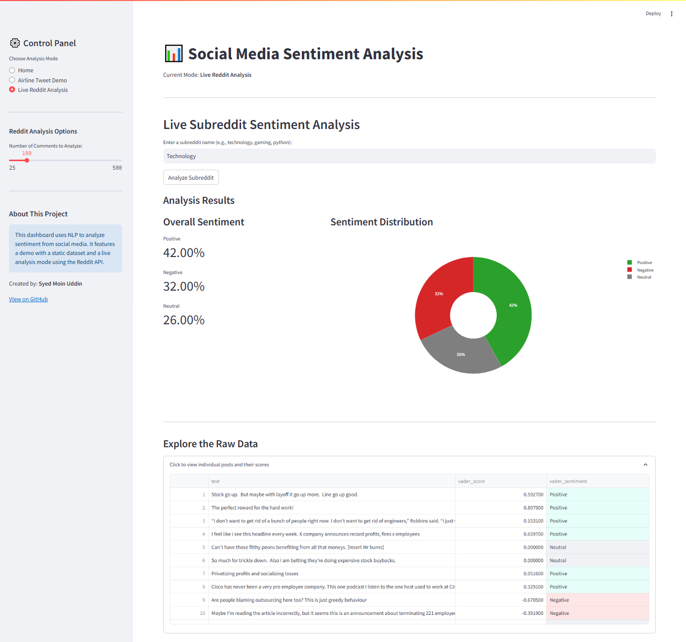

# Social Media Sentiment Analysis Dashboard

An interactive web application that analyzes public sentiment from social media in real-time. This project demonstrates skills in Natural Language Processing (NLP), data visualization, and building full-stack web applications with Python.

**Live Application URL:** [**Click here to view the live dashboard!**](https://sentiment-dashboard-syed.streamlit.app/)

---

## Table of Contents
* [Project Overview](#project-overview)
* [Features](#features)
* [Technical Stack](#technical-stack)
* [Project Structure](#project-structure)
* [Key Technical Concepts Demonstrated](#key-technical-concepts-demonstrated)
* [How to Run This Project Locally](#how-to-run-this-project-locally)

---

## Project Overview

In today's digital landscape, understanding public opinion is crucial for businesses, brands, and public figures. This project provides a powerful tool to tap into the global conversation on social media platforms like Reddit.

The application allows users to enter any keyword or topic (e.g., a brand, a product, a current event) and instantly receive a detailed breakdown of the public sentiment surrounding it. The analysis is performed using a pre-trained NLP model, and the results are presented in a clean, interactive, and easy-to-understand dashboard.

This project was built in two main phases:
1.  **Exploratory Analysis (Jupyter Notebook):** An initial analysis was performed on a static dataset of US Airline tweets to validate the chosen sentiment analysis model (VADER).
2.  **Application Development (Streamlit App):** The core logic was migrated into a full-fledged web application, and a live data integration with the Reddit API was implemented.

---

## Features

This dashboard is equipped with the following features:

*   **Dual Analysis Modes:**
    *   **Static Demo:** Analyze a pre-loaded dataset of US Airline tweets to see a baseline analysis.
    *   **Live Reddit Analysis:** Enter any public subreddit name to fetch and analyze hundreds of recent comments in real-time.
*   **Interactive UI:** A clean, professional, and responsive user interface built with Streamlit.
*   **At-a-Glance Metrics:** Key performance indicators (KPIs) show the exact percentage of positive, negative, and neutral sentiment.
*   **Rich Visualizations:** An interactive donut chart created with Plotly provides a clear visual breakdown of the sentiment distribution.
*   **Raw Data Exploration:** Users can expand a section to view the raw comments and their corresponding sentiment scores for a deeper dive.



---

## Technical Stack

This project leverages a modern, efficient stack of data science and web development tools:

*   **Language:** Python 3.12.10
*   **Core Libraries:**
    *   **Streamlit:** For building the interactive web application front-end.
    *   **Pandas:** For efficient data manipulation and structuring.
    *   **Plotly:** For creating rich, interactive data visualizations.
*   **NLP Engine:**
    *   **VADER (Valence Aware Dictionary and sEntiment Reasoner):** A lexicon and rule-based sentiment analysis tool specifically tuned for social media text.
*   **Data Acquisition:**
    *   **PRAW (Python Reddit API Wrapper):** For fetching live data from Reddit's API.
*   **Development Environment:** Jupyter Notebook, VS Code
*   **Deployment:** Streamlit Community Cloud

---

## Project Structure

The project is organized as follows:
```
.
├── .streamlit/
│   └── secrets.toml        # (Local Only - Ignored by Git) Stores API credentials securely
├── assets/
│   └── dashboard_screenshot.png # App screenshot
├── .gitignore              # Specifies files for Git to ignore (like secrets.toml)
├── Sentiment_Analysis_EDA.ipynb # Jupyter Notebook for initial exploration and model validation
├── app.py                  # The main Python script for the Streamlit web application
├── requirements.txt        # A list of all required Python libraries for reproducibility
└── Tweets.csv              # The static dataset used for the demo mode
```
---

## Key Technical Concepts Demonstrated

*   **API Integration:** Successfully connected to the Reddit API (using PRAW) to fetch live data, handling credentials securely.
*   **NLP with Pre-Trained Models:** Leveraged VADER, a powerful pre-trained model, to perform sentiment analysis without needing to train a model from scratch.
*   **Full-Stack Application Development:** Built a complete application, from the data processing backend to the interactive frontend, using a single language (Python).
*   **Data Caching:** Implemented Streamlit's caching (`@st.cache_data`) to optimize performance and avoid redundant data loading and API calls.
*   **Secure Credential Management:** Used Streamlit's secrets management and a `.gitignore` file to ensure API keys were not exposed on GitHub.
*   **UI/UX Design:** Focused on creating a clean, intuitive, and professional user interface with clear layouts, metrics, and interactive charts.

---

## How to Run This Project Locally

1.  **Prerequisites:**
    *   Python 3.8+
    *   An IDE or text editor (e.g., VS Code)
    *   A Reddit account with API credentials (see [Reddit's App Preferences](https://www.reddit.com/prefs/apps) to create a "script" app).

2.  **Clone the Repository:**
    ```bash
    git clone https://github.com/imSyedMoinUddin/Sentiment-Analysis-Dashboard
    cd Sentiment-Analysis-Dashboard
    ```

3.  **Install Dependencies:**
    ```bash
    pip install -r requirements.txt
    ```

4.  **Set Up Your Credentials:**
    *   Create a folder named `.streamlit` in the root directory.
    *   Inside `.streamlit`, create a file named `secrets.toml`.
    *   Add your Reddit credentials to the `secrets.toml` file:
        ```toml
        REDDIT_CLIENT_ID = "YOUR_CLIENT_ID"
        REDDIT_CLIENT_SECRET = "YOUR_SECRET"
        REDDIT_USERNAME = "YourRedditUsername"
        ```

5.  **Run the Streamlit App:**
    ```bash
    streamlit run app.py
    ```
    The application will open in a new tab in your web browser.